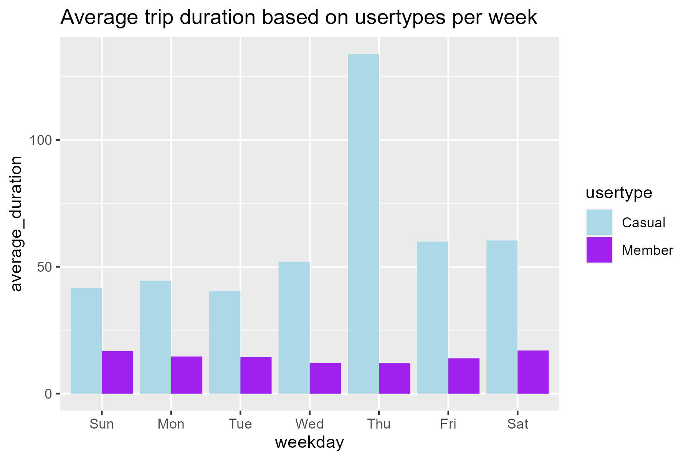
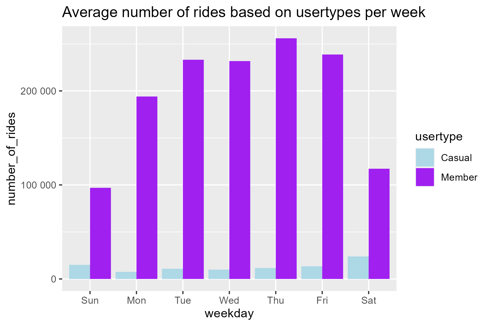

# Author : Saad Umar Alhassan

# CASE STUDY 1: HOW DOES A BIKE-SHARE NAVIGATE SPEEDY SUCCESS ?

## Background of Study

A bike-share program that features more than 5,800 bicycles and 600 docking stations. Cyclistic sets itself apart by also offering reclining bikes, hand tricycles, and cargo bikes, making bike-share more inclusive to people with disabilities and riders who can't use a standard two-wheeled bike. The majority of riders opt for traditional bikes; about 8% of riders use the assistive options. Cyclistic users are more likely to ride for leisure, but about 30% use them to commute to work each day. The director of marketing believes the company's future success depends on maximizing the number of annual memberships. Therefore, your team wants to understand how casual riders and annual members use Cyclistic bikes differently.

## Business Task

Our goal is to understand how annual members and casual riders use Cyclistic bikes differently.

The Marketing team's goal is to formulate marketing strategies geared towards converting sporadic cyclists into annual members. However, to achieve this goal, the marketing analyst team must enhance their understanding of the differences between annual members and casual riders, the rationale behind casual riders opting for memberships, and the potential influence of digital media on their marketing tactics. The team is eager to analyze the historical bike trip data from Cyclistic to discern trends and insights.

## Data for this study

Data for this study was extracted from Cyclistic's (a fictional company) historical data. This data was made available by Motivate International Inc. at [(<https://divvy-tripdata.s3.amazonaws.com/index.html>)].

In this study, i opted to go with all data in 2019 year. Thus quarters 1 to 4. Therefore, four (4) sets of Data or tables was download from the website and extracted.

# PROCESS

### Analysis tools used for study

For this study R programming language was chosen. R program with its cleaning tools will help us clean and transform the large set of data being used. R allows us to perform a whole lot of statistical analysis on our data. It will allow us to really take a deeper look inside our data and do transformations as we want for a successful study.

### Data Integrity

The datasets in this study was provided by Motivate International Inc. and was hosted at [(<https://divvy-tripdata.s3.amazonaws.com/index.html>)]. We trust this dataset as it was obtained directly from its primary source. Also data has been authenticated by Google for purposes of this Certification course. All of the dataset ( thus all data for bike trips in 2019 ) for this study was found here.

# DATA CLEANING

For our study the required packages were installed `tidyverse` because it has all the required tools for our data cleaning and plotting. Also, data for all four quarters of 2019 was loaded

### Installing and loading necessary packages for cleaning and working on the bike dataset

```{r}
options(repos = c(CRAN = "https://www.stats.bris.ac.uk/R/"))
```


```{r}
# Installing and loading necessary packages for cleaning and working on the bike dataset

install.packages("tidyverse")
library(tidyverse)
```

### To begin with, all four (4) sets of data for quarter 1 to quarter 4 were loaded using `read_csv` function. All files were .csv files. Data frames for all four quarters were created as per code

```{r}
# Loading the bike dataset for year 2019 ( Q1-Q4)

bike_data_2019_Q1 <- read_csv("Divvy_Trips_2019_Q1.csv")
bike_data_2019_Q2 <- read_csv("Divvy_Trips_2019_Q2.csv")
bike_data_2019_Q3 <- read_csv("Divvy_Trips_2019_Q3.csv")
bike_data_2019_Q4 <- read_csv("Divvy_Trips_2019_Q4.csv")
```

### Used the `glimpse` to take a look at each table

```{r}
# Checking for consistency in all 4 datasets

glimpse(bike_data_2019_Q1)
glimpse(bike_data_2019_Q2)
glimpse(bike_data_2019_Q3)
glimpse(bike_data_2019_Q4)
```

### columns in `bike_data_2019_Q2` seem to have different name which do not match the other columns in the tables for Q1, Q3 and Q4. A closer look at the column names using the function `colnames` was necessary.

```{r}
colnames(bike_data_2019_Q2)
```

### Columns in `bike_data_2019_Q2`were renamed to match the column names in all the other bike datas for Q1,Q3 and Q4

```{r}
colnames(bike_data_2019_Q2) <- c("trip_id","start_time","end_time","bikeid","tripduration","from_station_id",
                                 "from_station_name","to_station_id","to_station_name","usertype",
                                 "gender","birthyear")
```

### Check to confirm new column names match the others

```{r}
# view columns in the new 2019 quarter2 table

glimpse(bike_data_2019_Q2)
colnames(bike_data_2019_Q2)
```

### Check column types in all four tables

```{r}
# check column types
str(bike_data_2019_Q1)
str(bike_data_2019_Q2)
str(bike_data_2019_Q3)
str(bike_data_2019_Q4)
```

### In order to be able to work properly with our data, we needed to convert the data in `trip_id` and `bikeid` data to character

```{r}
# converting trip_id and bikeid types to character

bike_data_2019_Q1 <-  mutate(bike_data_2019_Q1, trip_id = as.character(trip_id)
                   ,bikeid = as.character(bikeid))

bike_data_2019_Q2 <-  mutate(bike_data_2019_Q1, trip_id = as.character(trip_id)
                             ,bikeid = as.character(bikeid))

bike_data_2019_Q3 <-  mutate(bike_data_2019_Q1, trip_id = as.character(trip_id)
                             ,bikeid = as.character(bikeid))

bike_data_2019_Q4 <-  mutate(bike_data_2019_Q1, trip_id = as.character(trip_id)
                             ,bikeid = as.character(bikeid))
```

### Now that all the individual tables from the four(4) quartes are fine, We need to combine all the four tables into one using the `bind_rows` function. For this, a new data fram was created called `all_bike_trips_2019`

```{r}
# Combining all the four quarters into one data frame/table

all_bike_trips_2019 <- bind_rows(bike_data_2019_Q1,bike_data_2019_Q2,
                                 bike_data_2019_Q3,bike_data_2019_Q4)
```

### Next we inspect our new data frame

```{r}
glimpse(all_bike_trips_2019)
```


### For consistence with terms used by the company, we need to change the `usertype` variables. Substitute `Member` for `Subscriber` and `Casual` for `Customer`.

```{r}
all_bike_trips_2019 <- all_bike_trips_2019 %>%
  mutate(usertype = case_when(
    usertype == "Subscriber" ~ "Member",
    usertype == "Customer" ~ "Casual",
    TRUE ~ usertype
  ))
```

### Since membership type is level or category based, we would want to change `usertype` variable to a factor variable. This would help in future analysis of this dataframe.

```{r}
all_bike_trips_2019$usertype <- as.factor(all_bike_trips_2019$usertype)
```

# DATA TRANSFORMATION

### Transform the data to enable better aggregation by creating columns with year, month and day

```{r}
all_bike_trips_2019$date <- as.Date(all_bike_trips_2019$start_time)
all_bike_trips_2019$month <- format(as.Date(all_bike_trips_2019$date), "%m")
all_bike_trips_2019$day <- format(as.Date(all_bike_trips_2019$date), "%d")
all_bike_trips_2019$year <- format(as.Date(all_bike_trips_2019$date), "%Y")
all_bike_trips_2019$day_of_week <- format(as.Date(all_bike_trips_2019$date), "%A")
```

### find time difference in seconds between trips

```{r}
all_bike_trips_2019$ride_length <- difftime(all_bike_trips_2019$end_time,
                                            all_bike_trips_2019$start_time)
```

### Inspect columns in new bike trip data

```{r}
str(all_bike_trips_2019)
glimpse(all_bike_trips_2019)
```

### convert ride length to numeric for easy calculations

```{r}
all_bike_trips_2019$ride_length <- as.numeric(all_bike_trips_2019$ride_length)

# unique(all_bike_trips_2019$from_station_name)
```

### Removing bad data from our table

```{r}
all_trips_2019 <- all_bike_trips_2019[!(all_bike_trips_2019$ride_length<0),]

dim(all_trips_2019)

```

# Analysis

### Summarise the data

```{r}
summary(all_trips_2019$ride_length)
```

### Make comparison between Casual and Annual members by looking for the `mean`, `median`,`maximum` and `minimun` values of each usertype group

```{r}
aggregate(all_trips_2019$ride_length ~ all_trips_2019$usertype, FUN = mean)
aggregate(all_trips_2019$ride_length ~ all_trips_2019$usertype, FUN = median)
aggregate(all_trips_2019$ride_length ~ all_trips_2019$usertype, FUN = max)
aggregate(all_trips_2019$ride_length ~ all_trips_2019$usertype, FUN = min)
```

### Calculate for the average ride time per day for the Casual and Annual members

```{r}
aggregate(all_trips_2019$ride_length ~ all_trips_2019$usertype +
            all_trips_2019$day_of_week, FUN = mean)
```

### Re order days of the week as results appear mixed up

```{r}
all_trips_2019$day_of_week <- ordered(all_trips_2019$day_of_week,
                                    levels=c("Sunday", "Monday", "Tuesday",
                                             "Wednesday", "Thursday", "Friday",
                                             "Saturday"))
```

### Re-run average time per day for Casual and Annual members

```{r}
aggregate(all_trips_2019$ride_length ~ all_trips_2019$usertype +
            all_trips_2019$day_of_week, FUN = mean)
```

### Next thing to do is to analyse ridership data by user type and weekday

```{r}
 all_trips_2019_V2 <-  all_trips_2019 %>%
  mutate(weekday = wday(start_time,label = TRUE)) %>%
  group_by(usertype, weekday) %>%
  summarise(number_of_rides =n(), average_duration = mean(ride_length)) %>%
  arrange(usertype,weekday)
```

# Visualise the data for insights

### Visualizing avg trip duration by week as per usertype

```{r}

plot(plot1 <- all_trips_2019_V2 %>% ggplot(aes(x = weekday, y = average_duration, fill = usertype)) +
  scale_fill_manual(values = c("lightblue","purple"))+
  geom_col(position = "dodge") + ggtitle("Average trip duration based on usertypes per week"))
```


### Visualizing avg number of rides by week as per usertype

```{r echo=TRUE}
plot(plot2 <- all_trips_2019_V2 %>% ggplot(aes(x = weekday, y = number_of_rides, fill = usertype)) +
  scale_fill_manual(values = c("lightblue","purple"))+
  geom_col(position = "dodge") + ggtitle("Average number of rides based on usertypes per week") + scale_y_continuous(labels = scales::number_format(scale = 1)))
```


### Now that analysis and visualisations are done. It is vital we export the final `all_trips_2019_V2` data / table so our stakeholders can have it handy. To do that we need to install and load the `writexl` package

```{r}
# Export final `all_trips_2019_V2` file to excel

install.packages("writexl")
library(writexl)

```

### Now lets write the final `all_trips_2019` and `all_trips_2019_V2` table to an excel files.

#### Note that the `all_trips_2019` dataframe has more than a million observations hence a .csv file type will be suitable .

```{r}
write.csv(all_trips_2019, "all_trips_2019.csv", row.names = FALSE)
```
#### The `all_trips_2019_V2` dataframe can be exported as an excel file because it has summarised hence fewer observations.

```{r}
write_xlsx(all_trips_2019_V2, path = "all_trips_2019_V2.xlsx")
```

## Saving the plots (graph) 

```{r}

# Saving the plot as a high-quality image (e.g., PNG)
ggsave("plot1.png", plot = plot1, width = 6, height = 4, dpi = 300)
ggsave("plot2.png", plot = plot2, width = 6, height = 4, dpi = 300)
```


## Key Insights / What the Data tells

* Casual riders have their peak ride durations on Thursdays.
* Members have their peak number of rides on Thursdays too.
* Casual riders generally spend more time riding bikes than members.
* Members generally take more ride trips than casual riders.
* Casual riders generally take fewer trips than annual members but ride longer than annual members. It is safe to infer that casual riders use cyclistic bikes for leisure and not work.


# My recommendations to the team are :

* Since casual riders are the ones spending more time riding, the Marketing team could design a discounted annual membership package for casual riders.

* Casual riders could be offered more bike trips should they sign up to an annual package.

* The team could consider Offering a Thursday package for annual members. Thus members who sign up for the annual package could get more bike trips on Thursdays. This is an attempt to entice casual riders since they spend their most time on bikes on Thursdays.

```
